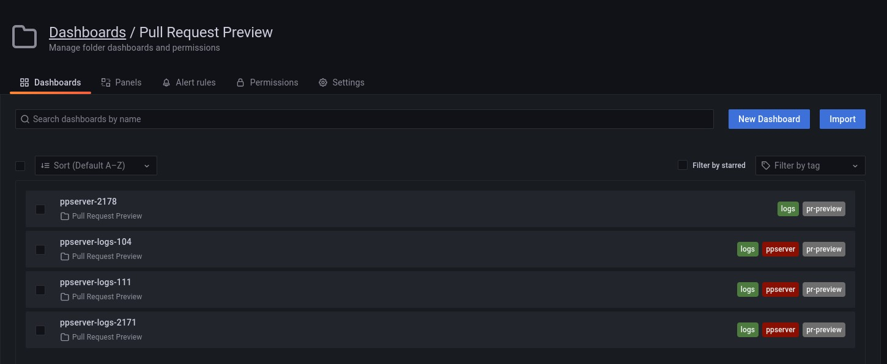

# Use Grafana HTTP API to create a ppserver logs dashboard

## [Create API tokens and dashboards for an organization][2]

Check an Grafana API key following help example:

```sh
export grafana_api_key=""
$ curl -H "Authorization: Bearer ${grafana_api_key}" -L https://humasandbox.grafana.net/api/dashboards/home
{"redirectUri":"/a/cloud-home-app"}
```

Got an question: curl not gets that kind of redirect.
Manually check redirected page, success. Got a big HTML page.

```sh
$ curl -H "Authorization: Bearer ${grafana_api_key}" https://humasandbox.grafana.net/a/cloud-home-app
<!doctype html><html lang="en"><head><meta charset="utf-8"/
<..>
</html>
```

## Find the "folderId" of my folder [Pull Request Preview][4]

[Get folder by uid][3]

```sh
$ curl -H "Authorization: Bearer ${grafana_api_key}"  -H "Content-Type: application/json" \
> -L https://humasandbox.grafana.net/api/folders/GlDJvxanz
{"id":23,"uid":"GlDJvxanz","title":"Pull Request Preview","url":"/dashboards/f/GlDJvxanz/pull-request-preview","hasAcl":false,"canSave":true,"canEdit":true,"canAdmin":false,"canDelete":true,"createdBy":"","created":"2022-02-09T15:22:50Z","updatedBy":"","updated":"2022-05-31T09:02:15Z","version":2}
```

## Create / Update dashboard

```sh
curl -XPOST -H "Authorization: Bearer ${grafana_api_key}"  -H "Content-Type: application/json" \
-L https://humasandbox.grafana.net/api/dashboards/db --data-binary @./ppserver-logs.json
{"id":28,"slug":"ppserver-logs-111","status":"success","uid":"139Tm4q7z","url":"/d/139Tm4q7z/ppserver-logs-111","version":1}
```

Refresh [the Dashboards / Pull Request Preview page][4] to see a new dashboard.



[1]: https://grafana.com/docs/grafana/v7.5/http_api/dashboard/
[2]: https://stackoverflow.com/questions/31166932/create-grafana-dashboards-with-api
[3]: https://grafana.com/docs/grafana/v7.5/http_api/folder/
[4]: https://humasandbox.grafana.net/dashboards/f/GlDJvxanz/pull-request-preview
